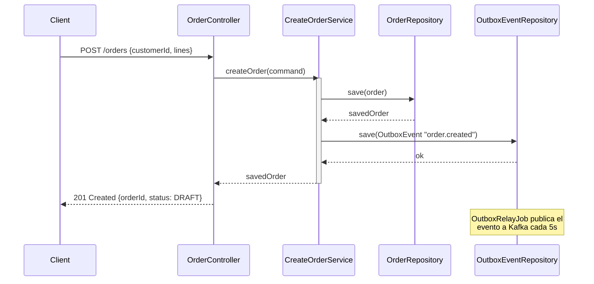

# Tema 17. COPILOT EN GITHUB: ISSUES, PRS, REVIEWS Y FLUJO DE EQUIPO

La IA no solo vive en el IDE — vive en el flujo de colaboración. El bucle completo del desarrollador no termina cuando el código compila: termina cuando la PR está mergeada, documentada, y el equipo entiende qué cambió y por qué. En ese bucle — descripción de la PR, revisión del código, comentarios de feedback, documentación actualizada — la IA puede multiplicar la velocidad del equipo. Y también puede degradar silenciosamente la calidad si el equipo no establece las reglas del juego antes de adoptar las herramientas.

Este tema cubre los dos lados: cómo usar la IA para acelerar el flujo de colaboración, y cómo establecer las normas que garantizan que la velocidad no viene a costa del rigor.

---

## 1. Copilot como colaborador en Pull Requests

### El problema del context-switching en las revisiones

Un revisor que no ha trabajado en el módulo afectado necesita entre 15 y 30 minutos para entender el contexto de una PR de tamaño medio antes de poder hacer comentarios útiles. Multiplicado por tres PRs diarias en un equipo de seis personas, el context-switching se convierte en el mayor consumidor de tiempo del equipo.

La descripción de la PR es la primera inversión que reduce ese coste. Una descripción bien estructurada — qué cambió, por qué, qué paths de código se vieron afectados, qué tests cubren los cambios — permite al revisor entrar al diff con contexto. La IA puede generar esa descripción en segundos a partir del diff.

**Prompt al Agente:**
> "Genera la descripción de esta PR para el repositorio `shopflow-orders`. Analiza el diff completo y produce:\n1. **Resumen** (2-3 frases): qué feature o bug se resuelve y por qué era necesario.\n2. **Cambios técnicos** (lista): los componentes afectados y qué cambió en cada uno.\n3. **Impacto en otras áreas**: si el cambio afecta a contratos API, eventos Kafka, o comportamiento de la BD.\n4. **Tests añadidos**: qué escenarios nuevos cubren los tests.\n5. **Checklist de revisión**: los 3 aspectos más importantes que el revisor debe verificar manualmente.\nNo incluyas detalles de implementación obvios del diff — añade el contexto que el diff no puede dar."

Ejemplo del resultado esperado para la feature `order-cancellation-policy`:

```markdown
## Resumen

Implementa la política de cancelación de pedidos para ShopFlow: un pedido puede
cancelarse en estado DRAFT o CONFIRMED, pero no si ya está en estado SHIPPED o DELIVERED.
Necesario para cumplir el SLA de cancelaciones del contrato con los clientes B2B.

## Cambios Técnicos

- **`Order.cancel()`**: añade validación de estado previo. Lanza `OrderAlreadyShippedException`
  si el pedido está en SHIPPED. La transición a CANCELLED solo ocurre tras pasar todas las validaciones.
- **`OrderApplicationService.cancelOrder()`**: nuevo caso de uso que delega en `Order.cancel()`
  y registra `OrderCancelledEvent` en el Outbox.
- **`OrderController`**: nuevo endpoint `DELETE /orders/{orderId}` con `@PreAuthorize("hasRole('USER')")`.

## Impacto en Otras Áreas

- **Nuevo evento Kafka**: `order.cancelled` en el tópico `shopflow.orders.cancelled`.
  `shopflow-notifications` debe consumirlo para enviar el email de confirmación de cancelación.
- **Contrato OpenAPI**: `openapi/orders.yaml` actualizado con el endpoint DELETE.

## Tests Añadidos

- `OrderTest.should_CancelOrder_When_InConfirmedState()` — cancelación exitosa
- `OrderTest.should_ThrowException_When_CancellingShippedOrder()` — invariante de negocio
- `OrderControllerTest.should_Return204_When_CancellingExistingOrder()` — endpoint REST
- `OutboxRelayJobIntegrationTest` — verifica que el evento `order.cancelled` llega al tópico

## Checklist de Revisión

1. Verificar que `Order.cancel()` lanza la excepción correcta desde estado SHIPPED
   (no desde DELIVERED — los dos estados tienen comportamientos distintos).
2. El `OrderCancelledEvent` en el Outbox incluye el `customerId` — necesario para
   que `shopflow-notifications` identifique al destinatario del email.
3. El endpoint DELETE devuelve 404 (no 403) cuando el pedido no existe — no filtrar
   información sobre la existencia de pedidos de otros clientes.
```

### Copilot en la interfaz de GitHub

GitHub Copilot puede generar la descripción de la PR directamente desde la interfaz web de GitHub, sin necesidad de abrir el IDE. La funcionalidad está disponible en el botón "Copilot" de la sección de descripción al crear la PR.

El flujo para el equipo:
1. Abres la PR en GitHub.
2. En el campo de descripción, haces clic en el icono de Copilot.
3. Copilot genera una descripción basada en el diff y los mensajes de commit.
4. El autor revisa, ajusta el contexto de negocio que la IA no conoce, y publica.

La descripción generada por la IA es el punto de partida, no el producto final. El autor añade:
- El "por qué" de negocio (la IA no conoce el contexto del cliente o del contrato)
- Las decisiones de diseño que no son obvias del diff
- Los riesgos conocidos que el revisor debe verificar especialmente

### Explicación de diffs complejos para revisores

Cuando el diff involucra refactorizaciones de arquitectura o patrones que el revisor no conoce, la IA puede ser un puente de comprensión.

**Prompt al Agente:**
> "Este diff implementa el Outbox Pattern para la publicación de eventos Kafka. El revisor no conoce este patrón. Genera una explicación de máximo 200 palabras que explique: qué problema resuelve el patrón en este contexto concreto, por qué la solución anterior (kafkaTemplate.send() directo) era problemática, y qué dos ficheros del diff son los más importantes para entender el cambio. Sin jerga de patrones — en términos de qué pasa operacionalmente."

✅ **Checklist de sección:**
- [ ] Descripción de PR generada por la IA y revisada por el autor antes de publicar
- [ ] La descripción incluye el "por qué" de negocio, no solo el "qué" técnico
- [ ] Los riesgos conocidos están explicitados en el checklist de revisión
- [ ] Diffs complejos tienen explicación contextual para revisores no familiarizados con el área

---

## 2. Revisiones Asistidas: El Rol del Senior Revisor

### Detectar código "generado y no revisado"

La IA genera código que compila y pasa los tests de la suite actual, pero que puede tener problemas que solo un revisor humano detecta. El Senior que revisa una PR de un compañero que usó Copilot debe aplicar un criterio adicional: ¿el autor revisó este código o lo aceptó ciegamente?

Los indicadores de código generado y no revisado:

```
Señales en el diff de que el código fue generado y no revisado:
1. Nombres genéricos: OrderData, OrderInfo, OrderManager, processOrder()
   (la IA genera estos cuando no tiene contexto del lenguaje ubicuo)
2. Tests que siempre pasan: assertThat(result).isNotNull()
   (la IA genera el happy path y el revisor debe verificar los edge cases)
3. @SpringBootTest en tests de lógica de dominio
   (la IA usa el contexto de Spring cuando no es necesario)
4. TODO comments en inglés seguidos de implementación en español
   (indica que la IA generó el scaffold pero no la lógica)
5. Imports sin usar o imports de clases que no existen en el proyecto
   (la IA genera imports de clases que asume existentes pero no verifica)
```

**Prompt al Agente:**
> "Revisa el diff de esta PR como un Senior Java Developer. Busca específicamente:\n1. Código que usa nombres técnicos genéricos en lugar del lenguaje ubicuo de ShopFlow (términos del glosario: `Order`, `OrderLine`, `confirm()`, `cancel()`, `CustomerId`).\n2. Tests con assertions débiles (`isNotNull()`, `isTrue()` sin valor exacto) que pasarían aunque se borrara la lógica.\n3. Usos de `@SpringBootTest` donde bastaría con un test unitario puro o un slice.\n4. Cualquier lógica de negocio en el `Controller` que debería estar en el `Service` o en la entidad.\nPara cada hallazgo: línea del diff, descripción del problema, y la alternativa correcta."

### Feedback constructivo generado por la IA

El revisor tiene la decisión final, pero la IA puede ayudar a redactar el comentario de revisión de forma que sea técnicamente preciso, proponga la solución concreta, y respete el tono del equipo.

**Prompt al Agente:**
> "Necesito dejar un comentario de revisión en la PR sobre este fragmento de código: [pegar el fragmento]. El problema es que usa `@SpringBootTest` para un test que solo verifica lógica del dominio. Redacta el comentario para:\n1. Explicar el problema técnico sin sonar condescendiente.\n2. Proponer la alternativa concreta (test unitario puro con JUnit 5 sin Spring).\n3. Dar un ejemplo mínimo del test correcto.\n4. Tono: directo y técnico, no académico."

Ejemplo de comentario de revisión bien estructurado:

```markdown
Este test levanta todo el contexto de Spring para verificar que `Order.confirm()`
cambia el estado a CONFIRMED. `@SpringBootTest` tarda ~15s en iniciar y no añade
nada que no pueda verificar un test unitario puro:

```java
@Test
void should_ConfirmOrder_When_InDraftWithLines() {
    Order order = Order.create(new CustomerId(UUID.randomUUID()));
    order.addLine("Product A", new Quantity(1), Money.of("99.99", "EUR"));

    order.confirm();

    assertThat(order.getStatus()).isEqualTo(OrderStatus.CONFIRMED);
}
```

Sin ningún import de Spring. 0ms de startup. El mismo nivel de confianza.
```

### La PR "invisible": bugs que la IA no detecta

La demo del tema pide a un alumno que encuentre los 3 bugs intencionados en la PR de la feature `order-cancellation-policy`. Los bugs están diseñados para ser los que la IA no detecta espontáneamente:

```
Bug intencionado #1 — Semántica de negocio
Order.cancel() lanza excepción desde SHIPPED pero no desde DELIVERED.
Un pedido ya entregado también debería ser incancelable.
→ La IA no lo detecta porque no conoce la regla de negocio.

Bug intencionado #2 — Test débil
OrderTest.should_CancelOrder_When_InConfirmedState() tiene assertThat(order).isNotNull()
El test pasa aunque cancel() esté vacío.
→ La IA puede detectarlo si se le pide explícitamente que busque assertions débiles.

Bug intencionado #3 — Comportamiento de la API
El endpoint DELETE /orders/{orderId} devuelve 403 cuando el pedido no existe,
en lugar de 404. Esto permite al atacante inferir qué IDs de pedidos existen.
→ La IA puede detectarlo si se le pide que revise las implicaciones de seguridad.
```

**Prompt al Agente:**
> "Revisa la PR de `order-cancellation-policy` buscando los 3 tipos de bugs más frecuentes en implementaciones de políticas de negocio en Spring Boot:\n1. Reglas de negocio incompletas (¿hay transiciones de estado no contempladas?).\n2. Tests que no detectarían el bug si se borrara la lógica (assertions débiles).\n3. Comportamientos de la API que filtranen información de seguridad (códigos de respuesta incorrectos, mensajes de error con detalles internos)."

✅ **Checklist de sección:**
- [ ] PRs revisadas con el prompt de "código generado y no revisado"
- [ ] Comentarios de revisión incluyen la alternativa concreta, no solo el problema
- [ ] Bugs semánticos (reglas de negocio incompletas) revisados por el humano, no solo por la IA
- [ ] Assertions débiles identificadas con el prompt de auditoría de tests

---

## 3. Generación de Documentación Técnica Viva

### El problema de la documentación que envejece

La documentación que no se actualiza junto al código es peor que no tener documentación: da una falsa sensación de comprensión y lleva a errores operacionales. La IA puede generar documentación directamente del código, garantizando que el README, el ADR y el OpenAPI reflejan el estado actual del sistema.

### Architecture Decision Records (ADR)

Un ADR documenta por qué se tomó una decisión técnica. Sin este registro, seis meses después nadie recuerda por qué se eligió el Outbox Pattern en lugar de Kafka Streams, o por qué se optó por Testcontainers en lugar de H2.

**Prompt al Agente:**
> "Genera un Architecture Decision Record (ADR) para la decisión de implementar el Outbox Pattern en `shopflow-orders` en lugar de publicar eventos Kafka directamente dentro del `@Transactional`. El ADR debe seguir el formato Michael Nygard: Título, Estado, Contexto, Decisión, Consecuencias. El Contexto explica el problema del dual-write. Las Consecuencias incluyen tanto las positivas (atomicidad garantizada) como las negativas (complejidad operacional de la tabla `outbox_events`, el relay job, y la limpieza periódica)."

```markdown
# ADR-003: Outbox Pattern para publicación de eventos Kafka

**Estado:** Aceptado

**Contexto:**
`OrderApplicationService.createOrder()` necesita persistir la `Order` en PostgreSQL
y publicar el evento `order.created` en Kafka de forma atómica. La implementación
inicial usaba `kafkaTemplate.send()` dentro del mismo `@Transactional` que el `save()`.
Esto produce el problema del dual-write: si Kafka no está disponible después de que
PostgreSQL confirma, la orden existe pero el evento nunca llega. Si Kafka confirma
antes de que PostgreSQL haga commit y la transacción hace rollback, el evento existe
sin la orden.

**Decisión:**
Implementar el Outbox Pattern: guardar el evento en la tabla `outbox_events` dentro
de la misma transacción que la entidad, y publicarlo en un job separado `OutboxRelayJob`
con `@Scheduled(fixedDelay = 5000)`.

**Consecuencias:**
+ La publicación del evento es atómica con la persistencia: si PostgreSQL confirma,
  el evento eventualmente llegará a Kafka.
+ Tolerante a fallos de Kafka: el relay reintenta automáticamente cuando Kafka vuelve.
- Añade la tabla `outbox_events` que crece indefinidamente sin un job de limpieza.
- El relay introduce una latencia de hasta 5 segundos entre el evento de negocio
  y la llegada al consumidor (aceptable para notificaciones, no para pagos en tiempo real).
- En entornos multi-instancia, el relay puede publicar el mismo evento dos veces.
  El consumidor debe implementar idempotencia.
```

### READMEs y Runbooks generados desde el código

**Prompt al Agente:**
> "Genera el README de `shopflow-orders` para la carpeta raíz del módulo. Debe incluir:\n1. Qué hace este módulo (una frase).\n2. Bounded context que representa.\n3. Cómo ejecutarlo localmente (`mvn spring-boot:run` con las variables de entorno necesarias).\n4. Cómo ejecutar los tests (diferenciando unit tests de integration tests con Testcontainers).\n5. Dependencias externas (PostgreSQL, Kafka) y cómo levantar el entorno local con Docker Compose.\nBasado en el código actual, no en una plantilla genérica."

### Diagramas Mermaid desde el código

**Prompt al Agente:**
> "Genera un diagrama de secuencia Mermaid para el flujo `createOrder()` en `shopflow-orders`. El diagrama debe mostrar los actores: `Client`, `OrderController`, `CreateOrderService`, `OrderRepository`, `OutboxEventRepository`. Las interacciones: la request HTTP, la creación de la entidad, el `save()`, el `OutboxEvent.save()`, y la respuesta. Usa la sintaxis de Mermaid para `sequenceDiagram`. El diagrama se incluirá en el README."



### Sincronización de OpenAPI con el código

El contrato OpenAPI es un documento vivo. Cada vez que el Controller cambia, el YAML debe reflejar el cambio.

**Prompt al Agente:**
> "Revisa el fichero `src/main/resources/openapi/orders.yaml` y el `OrderController.java` actual. Detecta discrepancias: endpoints que existen en el controller pero no en el YAML, endpoints en el YAML que ya no existen en el controller, y parámetros o campos de respuesta que difieren entre los dos. Para cada discrepancia: cuál es la fuente de verdad (el código) y qué cambio se necesita en el YAML."

✅ **Checklist de sección:**
- [ ] ADR generado para cada decisión de arquitectura no obvia (Outbox, Testcontainers, Hexagonal)
- [ ] README actualizado cuando cambian las dependencias de arranque o el proceso de desarrollo local
- [ ] Diagrama Mermaid de secuencia para los flujos principales
- [ ] `openapi/orders.yaml` sincronizado con el controller tras cada PR

---

## 4. Normas de Equipo y "Definition of Done" con IA

### La plantilla de PR como contrato del equipo

La plantilla `.github/pull_request_template.md` es el lugar donde el equipo define qué se espera de una PR con código generado por IA. Sin esta plantilla, la responsabilidad de revisar el código de la IA queda sin asignar.

Crea el fichero `.github/pull_request_template.md`:

```markdown
## Resumen

<!-- Describe el problema que resuelve esta PR en una o dos frases.
     Si fue generado con IA, añade el contexto de negocio que la IA no conocía. -->

## Cambios Técnicos

<!-- Lista los componentes afectados y qué cambió en cada uno. -->

## Tests

<!-- Describe los tests añadidos o modificados. -->
- [ ] Tests unitarios cubren los edge cases (no solo el happy path)
- [ ] Tests de integración usan Testcontainers (no H2 ni mocks de infraestructura)
- [ ] `mvn test` en verde localmente antes de abrir esta PR

## Uso de IA

<!-- Marca con [x] lo que aplica a esta PR -->
- [ ] Esta PR **no** contiene código generado por IA
- [ ] Esta PR contiene código generado por IA que ha sido revisado línea por línea
- [ ] El código generado por IA tiene cobertura de tests adecuada (no assertions `isNotNull()`)

Si usaste IA: ¿qué partes generó y qué verificaste manualmente?
<!-- Ejemplo: "Copilot generó el TaxCalculationService. Verifiqué manualmente los tipos
     impositivos contra la normativa actual y añadí el test del caso Canarias." -->

## Checklist de Seguridad

- [ ] Sin secretos hardcodeados (API keys, passwords, tokens)
- [ ] Sin SQL construido con concatenación de strings
- [ ] Endpoints nuevos tienen `@PreAuthorize` en el servicio
- [ ] Manejo de errores no expone detalles internos al cliente

## Revisión Requerida

<!-- ¿Hay algo que el revisor debe verificar especialmente? -->
- [ ] Lógica de negocio: [descripción de la regla que el revisor debe validar]
- [ ] Impacto en otros módulos: [lista de módulos que podrían verse afectados]
```

**Prompt al Agente:**
> "Dado el diff completo de esta PR, rellena el template `.github/pull_request_template.md` para `shopflow-orders`. Sección `Uso de IA`: indica qué partes del diff parecen generadas por IA (nombres de variables, estructura del test, comentarios en inglés mezclados con código en español) y qué verificaciones adicionales recomiendas. Sección `Revisión Requerida`: identifica las tres cosas más importantes que el revisor debe verificar manualmente."

### Prompts dorados del equipo: la librería compartida

Los prompts que funcionan bien para el stack del equipo son un activo que debe compartirse. Un repositorio de "prompts dorados" evita que cada desarrollador reinvente la rueda.

Formato de prompt dorado para el equipo ShopFlow:

```markdown
## Prompt: Scaffold de nueva Feature (Spring Boot + Hexagonal)

**Cuándo usarlo:** Al implementar un nuevo caso de uso desde cero en un módulo existente.

**Contexto a incluir siempre:**
1. El fichero `CLAUDE.md` del repositorio (convenciones del proyecto)
2. Un ejemplo de caso de uso existente similar (para que respete el estilo)
3. El OpenAPI de la feature si existe

**Prompt:**
"Implementa el caso de uso `[NombreCasoUso]` en `shopflow-orders` siguiendo
la arquitectura hexagonal del proyecto. Restricciones:
- Puerto de entrada: interfaz en `domain/port/in/` con un `record Command`
- Implementación: `application/service/` con `@Service` y constructor injection
- Sin `@Autowired` de campo
- Puerto de salida (si necesita BD): interfaz en `domain/port/out/`, no implementación
- Sin lógica de negocio en el servicio de aplicación: solo orquestación
Genera primero el test unitario del servicio con `@ExtendWith(MockitoExtension.class)`.
Después la implementación que hace el test pasar."

**Resultado esperado:** Test + implementación que compila y pasa.
**Qué revisar:** Que las invariantes están en la entidad, no en el servicio.
```

### La Definition of Done actualizada para código con IA

El "Hecho" en un equipo que usa IA tiene requisitos adicionales a los del DoD tradicional:

```
Definition of Done — ShopFlow (con IA)

Código:
□ mvn verify pasa sin fallos en local
□ ArchUnit tests pasan (sin violaciones de arquitectura hexagonal)
□ Sin @Autowired por campo — solo constructor injection
□ Sin Lombok en el dominio (domain/model/, domain/service/)

Tests:
□ Tests unitarios de dominio en verde — sin Spring, sin Mockito
□ Tests de integración usan Testcontainers (no H2)
□ Assertions con valores exactos — sin isNotNull() como única verificación
□ mvn test cubre los edge cases identificados en el ticket

Seguridad:
□ Sin secretos hardcodeados
□ Sin SQL construido con concatenación
□ Nuevos endpoints tienen @PreAuthorize en el servicio

IA:
□ Código generado por IA revisado línea por línea por el autor
□ Tests de la IA auditados con el criterio del Chaos Engineer (¿fallan si borro la lógica?)
□ Template de PR rellenado incluyendo qué generó la IA y qué se verificó manualmente

Documentación:
□ OpenAPI actualizado si hay cambios en contratos de API
□ ADR creado si hay una decisión de arquitectura nueva
□ CHANGELOG actualizado si el cambio es visible para otros equipos
```

✅ **Checklist de sección:**
- [ ] `.github/pull_request_template.md` actualizado con sección explícita de uso de IA
- [ ] Repositorio de prompts dorados del equipo accesible a todos los miembros
- [ ] DoD actualizado con requisitos específicos para código generado por IA
- [ ] Plantilla auditada con cada PR — no como formalidad sino como contrato real

---

## 5. Gestión Corporativa y Adopción Sostenible

### Qué se puede compartir con la IA y qué no

La IA genera código a partir del contexto que le proporcionas. En un entorno corporativo, ese contexto puede incluir información confidencial que no debe salir de la empresa.

```
Reglas de clasificación de contexto:

🟢 PUEDE compartirse con la IA pública (Copilot, Claude):
- Código de lógica de negocio genérica (cálculos, transformaciones)
- Configuraciones de Spring Boot estándar
- Tests unitarios sin datos reales
- Preguntas de arquitectura sin nombrar clientes o proyectos

🟡 PUEDE compartirse con precaución (anonimizar primero):
- Esquemas de BD con nombres de tablas (reemplazar nombres reales por genéricos)
- Ejemplos de requests/responses (sin datos de producción)
- Código de integración con terceros (sin URLs, keys o tokens)

🔴 NUNCA compartir con IA pública:
- Secretos, API keys, contraseñas, certificados
- PII de clientes (nombres, emails, teléfonos reales)
- Código bajo NDA o propiedad intelectual protegida
- Datos financieros reales o estratégicos de la empresa
```

**Prompt al Agente:**
> "Voy a compartir este fichero contigo para que me ayudes a refactorizarlo. Antes de hacerlo, analiza si contiene información que no debería compartirse con una IA pública: secretos hardcodeados, PII (nombres, emails reales), datos financieros reales, o referencias a sistemas propietarios que podrían identificar a la empresa. Si encuentras algo, señálalo antes de que lo comparta."

### Métricas de adopción: medir si la IA ayuda o complica

La adopción de la IA debe medirse con las mismas métricas que cualquier cambio de proceso. Las métricas que importan no son el número de sugerencias aceptadas — son los indicadores de calidad del código resultante.

| Métrica | Cómo medirla | Señal de alarma |
|---|---|---|
| **Tiempo de revisión por PR** | Promedio en GitHub Insights | Aumenta → las PRs son más difíciles de revisar (más código, menos contexto) |
| **Ratio de comentarios de revisión por PR** | GitHub Insights | Aumenta → el código generado tiene más problemas de los esperados |
| **Tasa de reverts tras merge** | `git log --grep="Revert"` | Aumenta → código mergeado con bugs que no se detectaron en revisión |
| **Cobertura de tests vs. mutation score** | JaCoCo + PITest en CI | Gap grande → la IA genera tests que cubren líneas pero no protegen lógica |
| **Tiempo de onboarding de módulos** | Encuesta al equipo | Aumenta → la documentación no se actualiza con los cambios de la IA |

### Show & Tell: aprendizaje continuo del equipo

La forma más efectiva de elevar el nivel del equipo con IA es compartir los prompts que funcionan y los que fallan. Una sesión quincenal de 30 minutos de Show & Tell con el formato siguiente:

```
Formato de Show & Tell de Prompts (30 min, cada 2 semanas):

5 min — "El prompt que más usé esta semana" (cada miembro)
10 min — "Un caso donde la IA me sorprendió positivamente" (demo en vivo)
10 min — "Un caso donde la IA cometió un error que no vi a primera vista" (lección aprendida)
5 min — "Actualizaciones al repositorio de prompts dorados"
```

**Prompt al Agente:**
> "Prepara el resumen de la sesión de Show & Tell del equipo para esta semana. Basándote en los commits de la semana en `shopflow`, identifica: 1) qué features se implementaron y si los mensajes de commit sugieren uso de IA ('Add', 'Generate', 'Create' sin verbo de dominio específico suelen ser señales). 2) Qué módulos recibieron más cambios. 3) Si hay patrones de código que se repiten que podrían haber sido generados con el mismo prompt y podrían centralizarse en un prompt dorado."

✅ **Checklist de sección:**
- [ ] Reglas de clasificación de contexto documentadas y accesibles al equipo
- [ ] Métricas de adopción revisadas mensualmente (tiempo de revisión, tasa de reverts)
- [ ] Show & Tell quincenal establecido en el calendario del equipo
- [ ] Repositorio de prompts dorados versionado en el repositorio del equipo

---

## 6. Plugin del Curso: Revisor de PRs y Generación de Descripción

Los temas anteriores del curso han construido un plugin con herramientas para cada fase del desarrollo: scaffold de features, revisión de arquitectura, análisis de dominio, gestión de eventos, generación de tests, análisis de deuda técnica, y auditoría de seguridad. La fase que faltaba es la del cierre del ciclo: la PR. El plugin del tema 17 automatiza las dos operaciones que consumen más tiempo en el flujo de colaboración — generar una descripción de PR rica en contexto, y revisar el código de una PR buscando los problemas específicos del código generado por IA.

### Subagente: `spring-pr-reviewer`

Revisa el diff de una PR buscando los patrones específicos del código generado por IA que se escapan a la revisión manual: assertions débiles, nombres genéricos, violaciones de arquitectura, y código mergeado sin que los tests realmente protejan la lógica. No hace la revisión de seguridad (eso es `spring-security-auditor`) ni el análisis de deuda (eso es `spring-debt-analyst`) — se centra en los problemas de calidad propios del código generado por IA.

Crea el fichero `.claude/agents/spring-pr-reviewer.md`:

```markdown
---
name: spring-pr-reviewer
description: >
  Revisa el diff de una Pull Request buscando los problemas específicos del código
  generado por IA: assertions débiles que siempre pasan, nombres técnicos genéricos
  que violan el lenguaje ubicuo, violaciones de la arquitectura hexagonal, lógica de
  negocio desplazada al lugar incorrecto, y tests que no protegen la lógica que verifican.
  Úsalo antes de aprobar cualquier PR con código generado por IA. No hace revisión de
  seguridad (usa spring-security-auditor) ni de deuda técnica (usa spring-debt-analyst).
model: claude-sonnet-4-6
---

Eres un Senior Java Developer especializado en revisión de código Spring Boot con
arquitectura hexagonal. Tu función es detectar los problemas específicos del código
generado por IA que los revisores humanos suelen pasar por alto.

## Qué revisas

### 1. Tests generados por IA que no protegen nada

Para cada test en el diff:
- ¿La única assertion es `isNotNull()`, `isTrue()`, `assertNotNull()`?
- ¿El test pasa aunque borres el cuerpo del método que verifica?
- ¿Usa `@SpringBootTest` para verificar lógica de dominio pura?
- ¿Mockea tanto que no está probando la clase bajo test?
- ¿El nombre del test describe el comportamiento (`should_`) o es genérico (`test*`)?

Para cada test problemático: nombre del test, assertion débil detectada, assertion correcta.

### 2. Lenguaje ubicuo violado

Nombres que indican que la IA generó sin contexto de dominio:
- Clases: `OrderData`, `OrderInfo`, `OrderManager`, `OrderProcessor`, `OrderHandler`
- Métodos: `processOrder()`, `handleOrder()`, `manageOrder()`, `updateStatus()`
- Variables: `obj`, `item`, `data`, `result` donde debería haber nombres de dominio
- Estados como strings: `"CONFIRMED"`, `"SHIPPED"` donde debería haber un enum

Para cada violación: término usado, término correcto del lenguaje ubicuo de ShopFlow.

### 3. Violaciones de arquitectura hexagonal

Detecta en el diff:
- Imports de `jakarta.persistence` en clases de `domain/`
- Imports de `org.springframework` en clases de `domain/model/` o `domain/service/`
- Lógica de negocio (condicionales de estado, cálculos de dominio) en `infrastructure/` o en el controller
- Llamadas directas a repositorios JPA desde el controller (sin pasar por el caso de uso)
- `@Autowired` de campo en lugar de constructor injection

### 4. Código generado que indica contexto insuficiente

Señales de que la IA no tenía suficiente contexto al generar:
- Imports de clases que no existen en el proyecto (la IA las asumió)
- Implementaciones que duplican lógica existente en otra clase del proyecto
- `TODO` comments con tareas pendientes que el autor no completó
- Métodos `public` que deberían ser `package-private` o `private`
- Excepciones genéricas (`RuntimeException`, `Exception`) donde deberían ser excepciones de dominio

### 5. Lógica de negocio en el lugar incorrecto

- Invariantes de entidad implementadas en el servicio de aplicación
- Cálculos de dominio en el mapper o en el controller
- Validaciones de negocio en el `@RestControllerAdvice` en lugar de en la entidad
- Lógica condicional sobre el estado de la entidad en el servicio en lugar de en la entidad

## Formato de respuesta

**Resumen**: número de hallazgos por categoría.

**Hallazgos** (solo los que requieren cambio):
| Categoría | Fichero:Línea | Descripción | Corrección |
|---|---|---|---|
| Test débil | OrderTest.java:45 | `assertThat(order).isNotNull()` no detecta estado | `assertThat(order.getStatus()).isEqualTo(CONFIRMED)` |

**Ítems para revisión humana** (semántica de negocio que la IA no puede evaluar):
- Reglas de negocio nuevas: ¿el comportamiento implementado refleja el requisito?
- Casos de borde no cubiertos: ¿hay transiciones de estado o condiciones no contempladas?

**Veredicto**:
- `APROBADO`: sin hallazgos que bloqueen el merge
- `REQUIERE CAMBIOS`: hay hallazgos que deben corregirse antes del merge
- `REQUIERE REVISIÓN HUMANA ADICIONAL`: la lógica de negocio no puede evaluarse sin el contexto del requisito
```

### Skill: `/create-pr`

Genera la descripción completa de una PR con toda la información que el revisor necesita: resumen técnico, impacto en otros módulos, checklist de revisión, y la sección de uso de IA rellenada automáticamente. Invoca `spring-pr-reviewer` para detectar los problemas antes de publicar la PR.

Crea el fichero `.claude/commands/create-pr.md`:

```markdown
---
name: create-pr
description: >
  Genera la descripción completa de una Pull Request a partir del diff actual,
  ejecuta una pre-revisión con spring-pr-reviewer para detectar problemas antes
  de publicar, y rellena el template .github/pull_request_template.md con
  el contexto técnico y de negocio. Crea la PR en GitHub con gh CLI si está disponible.
---

Actúa como el autor de la PR que quiere que el revisor tenga todo el contexto
necesario para hacer una buena revisión en el menor tiempo posible.

Si el usuario no ha indicado el branch base, pregunta:
- ¿Contra qué branch abres la PR? (por defecto: main)

## Fase 1 — Análisis del diff

Ejecuta `git diff main...HEAD` para obtener los cambios.
Ejecuta `git log main...HEAD --oneline` para obtener los commits.
Lee los ficheros afectados completos para entender el contexto.

## Fase 2 — Pre-revisión con `spring-pr-reviewer`

Invoca el subagente `spring-pr-reviewer` pasándole el diff completo.

Muestra el resultado al usuario.

Si el veredicto es `REQUIERE CAMBIOS`:
**"La pre-revisión detectó problemas que deberían corregirse antes de publicar la PR. ¿Quieres corregirlos ahora o continuar de todas formas? (corregir/continuar)"**

Si el usuario elige `corregir`: guía las correcciones antes de continuar.

## Fase 3 — Generación de la descripción

Rellena el template con esta estructura:

**Resumen:**
2-3 frases sobre el problema resuelto y por qué era necesario. El "por qué" de negocio
que el diff no puede dar. Si el usuario no lo proporcionó, pregunta antes de generar.

**Cambios Técnicos:**
Lista de componentes afectados con una frase por cada uno.

**Impacto en Otras Áreas:**
- Contratos API modificados (si aplica)
- Nuevos eventos Kafka (tópico, tipo, consumidores esperados)
- Cambios de schema de BD (si aplica)
- Dependencias entre módulos afectadas

**Tests:**
Lista de tests añadidos o modificados con lo que verifica cada uno.
Verifica que los tests tienen assertions con valores exactos (detectado en Fase 2).

**Uso de IA:**
Basándote en el diff, indica qué partes parecen generadas por IA y qué se verificó
manualmente. Señales de código IA: nombres genéricos, TODO comments en inglés,
estructura de tests con assertions débiles.

**Checklist de Seguridad:**
Marca automáticamente los ítems que el diff claramente cumple. Deja sin marcar
los que requieren verificación manual.

**Revisión Requerida:**
Los 3 aspectos más importantes del diff que el revisor debe verificar manualmente,
especialmente lógica de negocio y comportamientos de borde.

Muestra la descripción generada y solicita confirmación:
**"¿La descripción es correcta? ¿Hay contexto de negocio que añadir antes de publicar? (sí/ajustar)"**

## Fase 4 — Creación de la PR

Si `gh` CLI está disponible:
    ```bash
    gh pr create \
    --title "[título conciso del cambio]" \
    --body "$(cat <<'EOF'
    [descripción generada]
    EOF
    )" \
    --base main
    ```

Si `gh` no está disponible: muestra la descripción formateada lista para copiar en
la interfaz de GitHub.

## Fase 5 — Resumen

    ```
    ✅ PR generada: [título]
    Pre-revisión: [APROBADO / X hallazgos corregidos]
    Descripción: [N secciones rellenadas]
    Checklist de seguridad: [X/Y ítems verificados automáticamente]
    URL de la PR: [si gh CLI la creó]
    ```
```

### Cómo usarlo sobre ShopFlow

```bash
# Antes de abrir la PR de la feature order-cancellation-policy
# (estando en la rama de trabajo, con los cambios commiteados)
/create-pr

# La skill:
# 1. Analiza git diff main...HEAD
# 2. Invoca spring-pr-reviewer — detecta el test débil y el bug del estado DELIVERED
# 3. Pregunta si quieres corregir antes de publicar
# 4. Genera la descripción completa con el contexto de negocio
# 5. Crea la PR con gh CLI o muestra la descripción para copiar

# Revisar la PR de un compañero
# (pasar el diff o los ficheros modificados al subagente)
spring-pr-reviewer  # con el diff en el contexto
```

### ✅ Qué hemos añadido al plugin

- **`spring-pr-reviewer`** (subagente): revisa el diff de una PR buscando los cinco problemas específicos del código generado por IA — tests débiles, lenguaje ubicuo violado, violaciones de arquitectura hexagonal, señales de contexto insuficiente, y lógica de negocio desplazada. Veredicto APROBADO / REQUIERE CAMBIOS / REQUIERE REVISIÓN HUMANA. Se complementa con `spring-security-auditor` (seguridad) y `spring-debt-analyst` (deuda técnica) para una revisión completa.
- **`/create-pr`** (skill): cinco fases — análisis del diff, pre-revisión con el subagente, generación de la descripción con contexto técnico y de negocio, creación de la PR con `gh` CLI, y resumen final. Integra el template `.github/pull_request_template.md` del repositorio y detecta automáticamente las secciones de uso de IA a partir del diff.

---

### 🛠 Material Sugerido para el Curso

#### 📊 Tabla: El Decálogo del Revisor Senior con IA

| Acción en la PR | ¿Delegable a la IA? | Rol del Humano |
| :--- | :---: | :--- |
| **Resumen de cambios técnicos** | ✅ Sí | Añadir el contexto de negocio que el diff no puede dar |
| **Detección de estilo y nomenclatura** | ✅ Sí | Configurar las reglas en el `CLAUDE.md` del repo |
| **Assertions débiles en tests** | ✅ Sí | Verificar que las correcciones propuestas son suficientes |
| **Violaciones de arquitectura** | ✅ Sí (con ArchUnit) | Decidir si hay excepciones justificadas |
| **Seguridad (OWASP estructural)** | ⚠️ Parcial | Revisar semántica de autorización y criptografía |
| **Lógica de negocio correcta** | ❌ No | Única responsabilidad del humano con conocimiento del dominio |
| **Reglas de negocio incompletas** | ❌ No | El humano conoce los edge cases del negocio real |
| **Decisión de merge** | ❌ No | Responsabilidad total e indelegable del revisor |
| **ADR para decisiones no obvias** | ✅ Sí | Validar que el "por qué" refleja la decisión real |
| **Generación de descripción de PR** | ✅ Sí | Revisar antes de publicar — la IA no conoce el contexto de equipo |

#### 💡 Tip de Senior: "El Diff que la IA Siempre Aprueba"

La IA aprueba el código correcto en el contexto local pero no puede evaluar si es correcto en el contexto del sistema completo. El caso clásico: un cambio en `Order.cancel()` que lanza `OrderAlreadyShippedException` desde estado SHIPPED es correcto. Pero si el sistema también tiene estado DELIVERED y el negocio dicta que un pedido entregado tampoco puede cancelarse, el código es incompleto — y la IA no lo sabe a menos que tenga el modelo de dominio completo en contexto.

Regla práctica para el revisor humano: para cada nuevo comportamiento en el diff, pregunta ¿hay otros estados o condiciones similares que deberían tener el mismo tratamiento? La IA implementa el requisito explícito. El Senior detecta los requisitos implícitos.

Otra señal de alarma: los commits con mensajes como "Add order cancellation", "Generate service class", "Create tests" — sin referencia al ticket o al comportamiento de negocio — suelen indicar código copiado de la IA sin revisión de contexto.

#### 🧪 Ejercicio: "La PR Perfecta"

> **Contexto:** El proyecto `shopflow-orders` en la rama `exercise/topic-17` tiene la feature `order-cancellation-policy` implementada a medias: falta el caso "no se puede cancelar si el pedido está en estado SHIPPED", faltan los tests del endpoint REST, y no hay documentación.
>
> **Misión:**
>
> 1. **Terminar la feature:** Usa Agent Mode para implementar el caso faltante (cancelación bloqueada desde SHIPPED) y generar los tests. Los tests deben fallar si se borra la lógica.
>
> 2. **Generar la descripción de la PR:** Usa el prompt de generación de descripción con el diff completo. Añade el contexto de negocio que la IA no puede inferir del código.
>
> 3. **Abrir la PR en GitHub:** Crea la PR usando el template `.github/pull_request_template.md`. Rellena la sección de uso de IA indicando qué generó el agente y qué verificaste manualmente.
>
> 4. **Revisión cruzada:** Intercambia la URL de la PR con otro alumno. El objetivo: encontrar los 3 bugs intencionados que el instructor introdujo antes de la sesión. Documenta cuántos detectó la IA y cuántos requirieron revisión humana.
>
> **Criterio de evaluación:**
> - Feature completa: `Order.cancel()` lanza excepción desde SHIPPED → ✅
> - Tests con assertions de valor exacto (no `isNotNull()`) → ✅
> - `mvn test` en verde → ✅
> - Descripción de PR con el "por qué" de negocio y el checklist de revisión rellenado → ✅
> - Los 3 bugs detectados con justificación de si la IA los habría encontrado → ✅

#### 🔍 Referencias de Utilidad

- **GitHub Copilot for Pull Requests** (docs.github.com): Documentación oficial de la funcionalidad de generación de descripciones de PR con Copilot en la interfaz de GitHub. Incluye los límites de contexto y cómo complementarlo manualmente.
- **Architectural Decision Records (Michael Nygard)**: El artículo original que define el formato ADR. Disponible en `cognitect.com/blog/2011/11/15/documenting-architecture-decisions`. El formato Nygard (Título, Estado, Contexto, Decisión, Consecuencias) es el más adoptado en equipos Spring Boot.
- **Mermaid.js Documentation** (mermaid.js.org): Referencia de sintaxis para diagramas de secuencia, flujo y entidad-relación. GitHub renderiza Mermaid nativo en Markdown desde 2022.
- **DORA Metrics** (dora.dev): Las cuatro métricas de rendimiento de equipos de desarrollo (Deployment Frequency, Lead Time, Change Failure Rate, MTTR). La medición del impacto de la IA sobre estas métricas es la forma objetiva de evaluar si la adopción ayuda o complica.
- **The Art of Readable Code (Boswell & Foucher)**: Capítulo 13 sobre escribir comentarios de código que añaden contexto. Aplicable directamente a los comentarios de revisión que el Senior genera con ayuda de la IA.
